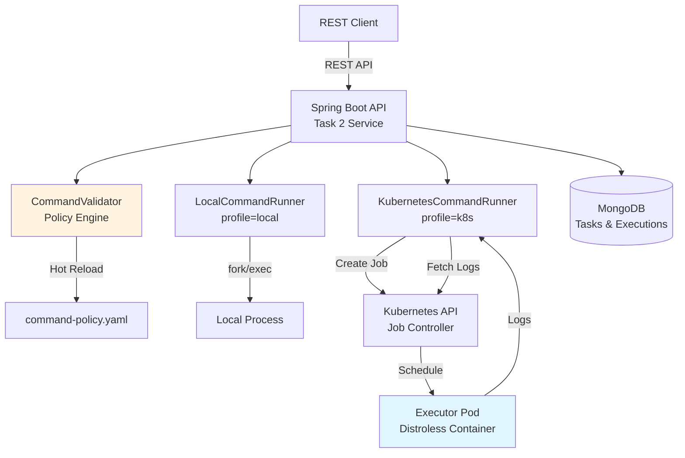

# Kaiburr Task 2 — Kubernetes Job Execution

**Author:** Aditya R  
**Repository:** kaiburr-task2  
**Assessment:** Kaiburr 2025 — Task 2

---

## Overview

Task 2 extends the Task 1 REST API with **Kubernetes-native command execution**. Instead of running commands locally, each execution spawns a **Kubernetes Job** with strict security policies, resource limits, and policy-as-data validation.

### What Makes This Unique

- **Zero-Trust Executor Container**: Distroless image with no shell, allowlisted binaries only, runs as non-root with read-only root FS
- **Policy-as-Data with Hot Reload**: Command validation rules in YAML, reloadable without service restart
- **Production Security**: seccomp RuntimeDefault, dropped capabilities, NetworkPolicy default-deny, RBAC least-privilege
- **Dual-Mode Runner**: Same REST API works with local execution (dev) or Kubernetes Jobs (prod) via Spring profiles
- **Full Observability**: JSON structured logs with correlation IDs, Micrometer metrics, execution audit trail
- **CI with kind Integration**: GitHub Actions spins up kind cluster, builds executor, runs integration tests
- **Dry-Run Validation Endpoint**: Test command safety before execution
- **Async Execution Option**: Support for long-running commands with polling (config-driven)

---

## Architecture



---

## Prerequisites

- **JDK 17** or later
- **Maven 3.8+**
- **Docker** 20.10+
- **kubectl** 1.25+
- **kind** 0.17+ (or minikube)
- **MongoDB** 5.0+ (local or container)

---

## Quick Start

### 1. Bootstrap Kubernetes Development Environment

```bash
# Create kind cluster, apply manifests, build executor image
./scripts/dev-bootstrap-kind.sh
```

This script:
- Creates a kind cluster named `kaiburr`
- Applies namespace, RBAC, NetworkPolicy, ConfigMap
- Builds the executor container image
- Loads the image into kind
- Starts MongoDB container

### 2. Start the Application

```bash
# Run with Kubernetes profile (default)
mvn clean package
SPRING_PROFILES_ACTIVE=k8s \
MONGODB_URI=mongodb://localhost:27017/kaiburrdb \
K8S_NAMESPACE=kaiburr \
K8S_EXECUTOR_IMAGE=kaiburr-executor:dev \
mvn spring-boot:run
```

Or for local development without Kubernetes:

```bash
SPRING_PROFILES_ACTIVE=local \
MONGODB_URI=mongodb://localhost:27017/kaiburrdb \
mvn spring-boot:run
```

### 3. Run Demo Commands

```bash
./scripts/demo-commands.sh
```

### 4. Verify Kubernetes Execution

```bash
# Check Jobs and Pods
kubectl get jobs,pods -n kaiburr

# View logs from an executor pod
kubectl logs -n kaiburr -l app=kaiburr-exec --tail=50

# Check Job cleanup (TTL controller)
kubectl get jobs -n kaiburr --watch
```

---

## API Endpoints

All endpoints maintain the same contract as Task 1:

| Method | Endpoint | Description |
|--------|----------|-------------|
| `PUT` | `/api/tasks` | Create or update a task |
| `GET` | `/api/tasks` | List all tasks |
| `GET` | `/api/tasks/{id}` | Get task by ID |
| `GET` | `/api/tasks/search?name={substr}` | Search tasks by name |
| `DELETE` | `/api/tasks/{id}` | Delete task |
| `PUT` | `/api/tasks/{id}/executions` | Execute task command (creates K8s Job) |
| `POST` | `/api/validation/command` | Dry-run validate command (no execution) |

### Example: Execute a Command

```bash
# Create a task
curl -X PUT http://localhost:8080/api/tasks \
  -H "Content-Type: application/json" \
  -d '{
    "id": "task-001",
    "name": "System Info",
    "command": "uname",
    "args": ["-a"],
    "assignee": "Aditya R"
  }'

# Execute it (spawns K8s Job)
curl -X PUT http://localhost:8080/api/tasks/task-001/executions
```

Response includes `TaskExecution` with:
- Job name
- Exit code
- Stdout/stderr
- Duration
- Timestamp

### Example: Validate Command (Dry-Run)

```bash
curl -X POST http://localhost:8080/api/validation/command \
  -H "Content-Type: application/json" \
  -d '{
    "command": "rm",
    "args": ["-rf", "/"]
  }'
```

Response:
```json
{
  "valid": false,
  "reasons": [
    "Command 'rm' is denied by policy (dangerous operation)",
    "Argument contains denied metacharacter: /"
  ]
}
```

---

## Configuration

### Environment Variables

| Variable | Default | Description |
|----------|---------|-------------|
| `SPRING_PROFILES_ACTIVE` | `k8s` | `k8s` or `local` |
| `MONGODB_URI` | `mongodb://localhost:27017/kaiburrdb` | MongoDB connection string |
| `SERVER_PORT` | `8080` | HTTP port |
| `K8S_NAMESPACE` | `kaiburr` | Kubernetes namespace for Jobs |
| `K8S_EXECUTOR_IMAGE` | `kaiburr-executor:dev` | Executor container image |
| `K8S_TTL_SECONDS` | `120` | Job TTL after completion |
| `K8S_ACTIVE_DEADLINE_SECONDS` | `15` | Max Job runtime |
| `K8S_BACKOFF_LIMIT` | `0` | Job retry limit |
| `K8S_PULL_POLICY` | `IfNotPresent` | Image pull policy |
| `EXEC_ASYNC` | `false` | Enable async execution mode |

### Command Policy (`command-policy.yaml`)

Validation rules loaded from YAML with hot-reload support:

```yaml
denylist:
  commands: ["rm", "sudo", "kill", "curl", "wget", ...]
  metacharacters: [";", "|", "&", ">", "<", "`", "$", ...]
allowlist:
  binaries: ["echo", "date", "uname", "whoami", "id", "uptime", "printenv"]
limits:
  maxArgs: 8
  maxTotalLength: 200
  argumentPattern: "^[A-Za-z0-9._:/=-]{1,64}$"
timeouts:
  apiClientSeconds: 30
  jobActiveDeadlineSeconds: 15
output:
  maxStdoutBytes: 131072  # 128 KiB
  maxStderrBytes: 65536   # 64 KiB
```

---

## Security Hardening

### Executor Pod Security Context

```yaml
securityContext:
  runAsNonRoot: true
  runAsUser: 65532
  runAsGroup: 65532
  readOnlyRootFilesystem: true
  allowPrivilegeEscalation: false
  capabilities:
    drop: ["ALL"]
  seccompProfile:
    type: RuntimeDefault
```

### NetworkPolicy

Default-deny egress with optional DNS allowlist:

```yaml
apiVersion: networking.k8s.io/v1
kind: NetworkPolicy
metadata:
  name: kaiburr-executor-netpol
spec:
  podSelector:
    matchLabels:
      app: kaiburr-exec
  policyTypes:
    - Egress
  egress:
    - to:
      - namespaceSelector:
          matchLabels:
            name: kube-system
      ports:
        - protocol: UDP
          port: 53  # DNS only
```

### RBAC Least Privilege

ServiceAccount `kaiburr-runner` with Role limited to:
- `jobs`: create, get, list, watch, delete
- `pods`: get, list
- `pods/log`: get

---

## Observability

### Metrics (Micrometer)

Exposed at `/actuator/prometheus`:

- `kaiburr_executions_total{result="success|timeout|validation_error|runtime_error"}`
- `kaiburr_executor_duration_seconds`
- `kaiburr_job_create_duration_seconds`
- `kaiburr_log_fetch_duration_seconds`

### Structured Logs

JSON format with:
- `correlationId`: Per-request trace ID
- `taskId`: Task identifier
- `jobName`: Kubernetes Job name
- `phase`: `validation`, `job_create`, `job_wait`, `log_fetch`, `persist`
- `exitCode`: Process exit code
- `durationMs`: Execution duration

Example:
```json
{
  "timestamp": "2025-10-19T10:30:45.123Z",
  "level": "INFO",
  "logger": "dev.adityar.kaiburr.task2.service.KubernetesCommandRunner",
  "message": "Job completed successfully",
  "correlationId": "a7f3c9e1-8d2b-4f6e-9c1a-3b8e7d4f2a1c",
  "taskId": "task-001",
  "jobName": "exec-task-001-uuid",
  "phase": "job_wait",
  "exitCode": 0,
  "durationMs": 847
}
```

### Execution Audit Trail

Append-only `audit.log.jsonl`:

```json
{"timestamp":"2025-10-19T10:30:45.123Z","correlationId":"a7f3c9e1","taskId":"task-001","commandHash":"sha256:abc123","result":"success","durationMs":847}
```

---

## Testing

### Run All Tests

```bash
mvn clean test
```

### Test Coverage

- **CommandValidatorTest**: Denylist, allowlist, length limits, metacharacters
- **KubernetesCommandRunnerIT**: Success, timeout, bad binary, log capture, truncation (requires kind)
- **TaskServiceTest**: Persistence, execution flow, error handling
- **TaskControllerTest**: HTTP semantics, error responses, correlation IDs

### Integration Tests with kind

```bash
# Start kind cluster
kind create cluster --name kaiburr-test

# Load executor image
./scripts/build-and-load-executor.sh kaiburr-test

# Run integration tests
mvn verify -Pintegration-test
```

---

## CI/CD Pipeline

GitHub Actions workflow (`.github/workflows/ci.yml`) runs on every push/PR:

1. Setup JDK 17 and Maven cache
2. Start MongoDB container
3. Create kind cluster
4. Build and load executor image
5. Apply Kubernetes manifests
6. Run unit and integration tests
7. Generate coverage report
8. Upload test artifacts

---

## Threat Model (STRIDE)

| Threat | Mitigation | Evidence |
|--------|------------|----------|
| **Spoofing**: Attacker impersonates API | mTLS termination at ingress, correlation IDs | `CorrelationIdFilter.java` |
| **Tampering**: Modify command in-flight | Validated before execution, immutable Jobs | `CommandValidator.java` |
| **Repudiation**: Deny execution | Audit log with hashed commands | `AuditLogger.java` |
| **Info Disclosure**: Expose secrets | No env secrets in executor, read-only FS | `executor/Dockerfile` |
| **DoS**: Resource exhaustion | CPU/memory limits, timeout, rate limiting | `job-template.md`, `activeDeadlineSeconds` |
| **Elevation**: Container escape | Non-root, dropped caps, seccomp, no shell | `securityContext` in manifests |

See full analysis in `docs/threat-model.md`.

---

## Architecture Decision Records (ADRs)

- [ADR-0003: Kubernetes Job Runner](adr/0003-k8s-job-runner.md) — Why Jobs vs Pods
- [ADR-0004: Policy-as-Data](adr/0004-policy-as-data.md) — Externalized validation rules
- [ADR-0005: Async Execution Option](adr/0005-async-execution.md) — Polling vs blocking

---

## Screenshot Plan

All screenshots include system date/time and "Aditya R" watermark.

1. **kind cluster up**: `kubectl cluster-info --context kind-kaiburr`
2. **Namespace and RBAC**: `kubectl get ns,sa,role,rolebinding -n kaiburr`
3. **Executor image loaded**: `docker exec -it kaiburr-control-plane crictl images | grep kaiburr-executor`
4. **Successful execution**: `PUT /api/tasks/{id}/executions` response JSON
5. **Jobs and Pods**: `kubectl get jobs,pods -n kaiburr -o wide`
6. **Pod logs**: `kubectl logs <pod-name> -n kaiburr`
7. **Validation error**: `POST /api/validation/command` with denied command
8. **Timeout**: Execution exceeding `activeDeadlineSeconds`
9. **MongoDB record**: `db.tasks.findOne({"executions.0": {$exists: true}})`

See `scripts/make-screenshot-overlay.md` for watermark instructions.

---

## Build and Deployment

### Build Executor Image

```bash
cd executor
docker build -t kaiburr-executor:dev .
```

### Load into kind

```bash
kind load docker-image kaiburr-executor:dev --name kaiburr
```

### Apply Kubernetes Manifests

```bash
kubectl apply -f deploy/k8s/
```

### Package Application

```bash
mvn clean package
# JAR at target/task2-1.0.0-SNAPSHOT.jar
```

---

## RUN CHECK — Complete Verification

Copy-paste these commands to verify the complete system:

```bash
# 1. Create kind cluster
kind create cluster --name kaiburr

# 2. Build and load executor
cd executor
docker build -t kaiburr-executor:dev .
kind load docker-image kaiburr-executor:dev --name kaiburr
cd ..

# 3. Apply Kubernetes manifests
kubectl create namespace kaiburr
kubectl apply -f deploy/k8s/ -n kaiburr

# 4. Start MongoDB (if not running)
docker run -d --name mongo-kaiburr -p 27017:27017 mongo:5.0

# 5. Build and run application
mvn clean package
SPRING_PROFILES_ACTIVE=k8s \
MONGODB_URI=mongodb://localhost:27017/kaiburrdb \
K8S_NAMESPACE=kaiburr \
K8S_EXECUTOR_IMAGE=kaiburr-executor:dev \
java -jar target/task2-1.0.0-SNAPSHOT.jar

# 6. In another terminal, run demo
./scripts/demo-commands.sh

# 7. Verify Kubernetes resources
kubectl get jobs,pods -n kaiburr
kubectl logs -n kaiburr -l app=kaiburr-exec --tail=20

# 8. Check MongoDB
docker exec -it mongo-kaiburr mongosh kaiburrdb --eval 'db.tasks.find().pretty()'

# 9. View metrics
curl http://localhost:8080/actuator/prometheus | grep kaiburr_executions

# 10. Swagger UI
open http://localhost:8080/swagger-ui.html
```

---

## Project Structure

```
kaiburr-task2/
├── README.md                       # This file
├── LICENSE                         # MIT License
├── pom.xml                         # Maven build configuration
├── .gitignore                      # Git ignore patterns
├── api-spec/
│   └── openapi.yaml                # OpenAPI 3.0 specification
├── adr/                            # Architecture Decision Records
│   ├── 0003-k8s-job-runner.md
│   ├── 0004-policy-as-data.md
│   └── 0005-async-execution.md
├── docs/
│   ├── arch-diagram.mmd            # Mermaid architecture diagram
│   ├── threat-model.md             # STRIDE threat analysis
│   ├── postman-collection.json     # Postman API tests
│   └── screenshots/                # Embedded screenshots
├── deploy/
│   └── k8s/                        # Kubernetes manifests
│       ├── namespace.yaml
│       ├── serviceaccount.yaml
│       ├── role.yaml
│       ├── rolebinding.yaml
│       ├── networkpolicy.yaml
│       ├── configmap-policy.yaml
│       └── job-template.md
├── executor/
│   ├── Dockerfile                  # Distroless executor image
│   └── docs/
│       └── allowed-binaries.md     # Binary allowlist documentation
├── scripts/
│   ├── dev-bootstrap-kind.sh       # Setup kind cluster
│   ├── build-and-load-executor.sh  # Build and load image
│   ├── demo-commands.sh            # API demo commands
│   └── make-screenshot-overlay.md  # Screenshot watermark guide
├── src/main/java/dev/adityar/kaiburr/task2/
│   ├── KaiburrTask2Application.java
│   ├── config/
│   │   ├── KubernetesClientConfig.java
│   │   ├── LoggingConfig.java
│   │   ├── CorrelationIdFilter.java
│   │   ├── CorsConfig.java
│   │   └── OpenApiConfig.java
│   ├── controller/
│   │   ├── TaskController.java
│   │   ├── ValidationController.java
│   │   └── GlobalExceptionHandler.java
│   ├── domain/
│   │   ├── Task.java
│   │   └── TaskExecution.java
│   ├── dto/
│   │   ├── TaskRequest.java
│   │   ├── TaskResponse.java
│   │   ├── TaskExecutionResponse.java
│   │   ├── CommandValidationRequest.java
│   │   ├── CommandValidationResponse.java
│   │   └── ErrorResponse.java
│   ├── repo/
│   │   └── TaskRepository.java
│   ├── service/
│   │   ├── CommandRunner.java
│   │   ├── LocalCommandRunner.java
│   │   ├── KubernetesCommandRunner.java
│   │   ├── TaskService.java
│   │   └── CommandValidator.java
│   └── util/
│       ├── SafeProcessIO.java
│       └── AuditLogger.java
├── src/main/resources/
│   ├── application.yml
│   ├── command-policy.yaml
│   └── banner.txt
└── src/test/java/dev/adityar/kaiburr/task2/
    ├── CommandValidatorTest.java
    ├── KubernetesCommandRunnerIT.java
    ├── TaskServiceTest.java
    └── TaskControllerTest.java
```

---

## Contributing

This is an assessment project by **Aditya R**. For questions or improvements, open an issue.

---

## License

MIT License - See [LICENSE](LICENSE) file.

---

**Built by Aditya R for Kaiburr Assessment 2025**
